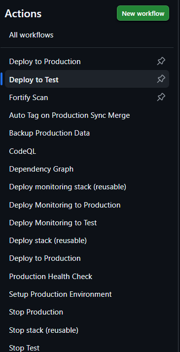
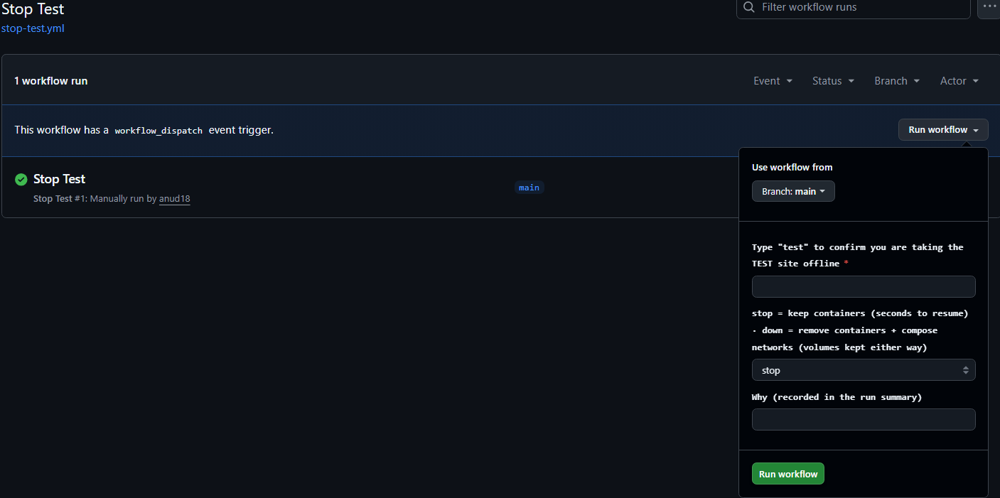

# Step 1
進到 GitHub Action 網站
https://github.com/NYCUITSC/naass/actions

# Step 2
選擇要停止 Test 還是 Production 環境的系統運行
選擇下面對應的 Workflow
`Stop Test`

`Stop Production`

# Step 3
點擊 Run Workflow

若是停止 test 環境則在第一項輸入 `test`
Production 環境則是輸入 `production`
接著點擊綠色的 `Run workflow`
