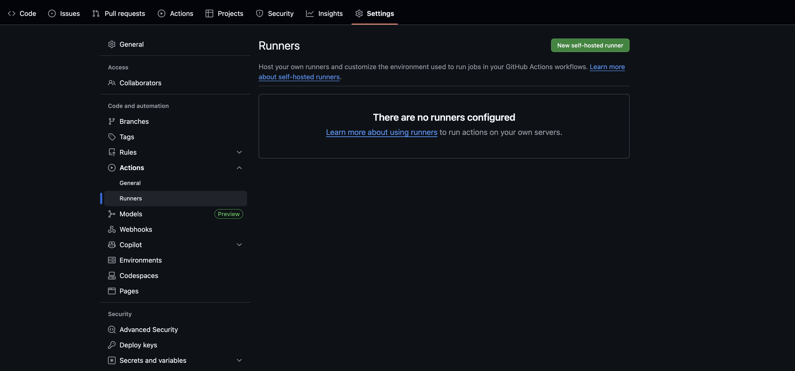
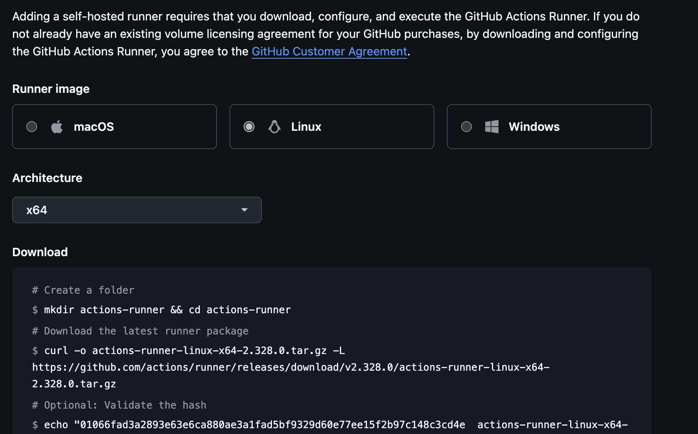

# NYCU Scholarship System — 正式機安裝手冊 (v1.0.7)


---

## 1. 硬體與軟體需求

### 1.1 建議規格

- **VM-A（App/Proxy）**：4 vCPU / 8–16 GB RAM / 40+ GB SSD
- **VM-B（DB/Storage）**：4–8 vCPU / 16–32 GB RAM / 200+ GB SSD（依附件上傳與備份策略調整）

### 1.2 作業系統

- Ubuntu LTS 24.04

### 1.3 必要套件

- Docker Engine（24+）與 Docker Compose v2
- OpenSSL、curl、ufw/iptables、rsync、cron（或 systemd timer）

---

## 2. 網路、DNS 與防火牆

- **DNS**：`ss.aa.nycu.edu.tw` → VM-A 公網/校內 IP

### 2.1 輸入連線（建議僅開必要埠）

**VM-A（App/Proxy）**

| 埠 | 服務 | 開給誰 |
| --- | --- | --- |
| `443/tcp` | Nginx（HTTPS） | 對外（使用者） |
| `80/tcp` | Nginx（只做 HTTP→HTTPS 轉址） | 選配，見下方說明 |
| `3100/tcp` | Loki | **只開 VM-B 私網 IP** |
| `9090/tcp` | Prometheus | **只開 VM-B 私網 IP** |

- **`80` 要不要開自行取捨**：compose 有發布這個埠，但那個 server block 只有 HTTP→HTTPS 的 301 轉址（外加 Let's Encrypt challenge 路徑）。不開的話使用者打 `http://` 會是「連線被拒」而不是被導去 https。
- **⚠️ `3100` 與 `9090` 沒有任何認證**，compose 是綁在 `0.0.0.0` 上發布的，一定要用防火牆把來源鎖成 VM-B，**絕不能對公網開**。會開在 VM-A 是因為監控的儲存端（Grafana / Loki / Prometheus）就跑在 VM-A 上，DB VM 的 Alloy 是「推」資料過來的（見第 4.6 節）。
- **Grafana 不用另外開埠**：它走 nginx 的 `/monitoring` 反向代理，從 `443` 進來。
- 其餘 app 端的服務（backend、frontend、Redis、cAdvisor、各種 exporter）在 compose 裡都只有 `expose`，留在 docker network 內，host 上沒有埠。

**VM-B（DB/Storage）**

| 埠 | 服務 | 開給誰 |
| --- | --- | --- |
| `5432/tcp` | PostgreSQL | **只開 VM-A 私網 IP** |
| `9000-9001/tcp` | RustFS API / Console | **只開 VM-A 私網 IP** |
| `9100/tcp` | node-exporter | **只開監控主機（VM-A）私網 IP** |
| `9187/tcp` | postgres-exporter | **只開監控主機（VM-A）私網 IP** |

- DB 與 RustFS **不要對公網開放**。走私有網段或 VPC Peering 時，一樣要限制來源 IP。
- `9100` 與 `9187` 由第 4.6 節的監控服務發布，跟 5432/9000/9001 一樣**只開給監控主機的私網 IP，不要對公網開**。

### 2.2 輸出連線

- **VM-A → VM-B**：`5432`、`9000`
- **VM-A → 外網**：`443`（GHCR 拉 image、GitHub Actions self-hosted runner、Portal SSO、校務 Student API）、SMTP（預設 `587`）
- **VM-B → VM-A**：`3100`、`9090`（Alloy 推 log 與 metrics，即 `.env` 裡 `MONITORING_SERVER_URL` 指到的位址）
- **VM-B** 一般沒有對外網路，image 走離線匯入（見第 3.1 節）

### 2.3 NTP

兩台 VM 時間要同步，避免 JWT/OIDC 與 TLS 出問題。

---

## 3. 安裝 Docker 與 Docker Compose（兩台 VM 都要做，並修正權限坑）

> DB VM 通常沒有對外網路，走**離線安裝**。AP VM 通常可以連外，走**線上安裝**。兩邊裝完後都要做「加入 docker group」這一步，不然 GitHub Actions runner 跟一般帳號操作 docker 都會卡在 permission denied。

### 3.1 DB VM：離線安裝

#### 3.1.1 在可聯外的中繼機準備安裝檔

```bash
mkdir -p ~/docker-offline && cd ~/docker-offline

sudo apt update && sudo apt upgrade -y
sudo apt install -y ca-certificates curl gnupg

sudo install -m 0755 -d /etc/apt/keyrings
curl -fsSL https://download.docker.com/linux/ubuntu/gpg | sudo tee /etc/apt/keyrings/docker.asc > /dev/null
sudo chmod a+r /etc/apt/keyrings/docker.asc

echo "deb [arch=$(dpkg --print-architecture) signed-by=/etc/apt/keyrings/docker.asc] https://download.docker.com/linux/ubuntu $(lsb_release -cs) stable" | sudo tee /etc/apt/sources.list.d/docker.list > /dev/null

sudo apt update

sudo apt install -y docker-ce docker-ce-cli containerd.io docker-buildx-plugin docker-compose-plugin

sudo apt download -y docker-ce docker-ce-cli containerd.io docker-buildx-plugin docker-compose-plugin
```

這會生成一堆 `.deb` 檔，例如：

    docker-ce_24.0.7-1~ubuntu.22.04_amd64.deb
    docker-ce-cli_24.0.7-1~ubuntu.22.04_amd64.deb
    ...

#### 3.1.2 在可聯外的中繼機匯出常用映像檔

DB VM 會跑 Postgres + RustFS（S3 相容物件儲存，取代舊的 MinIO），另外還有三個監控用的 image（第 4.7 節會用到）。**五個都要在中繼機存起來**——DB VM 沒有外網，漏掉哪一個，之後在 DB VM 上就補不回來，只能再跑一趟中繼機：

```bash
# DB / Storage
sudo docker pull postgres:15-alpine
sudo docker pull rustfs/rustfs:1.0.0-beta.8
# 監控（docker-compose.prod-db-monitoring.yml 用的，版本要跟 compose 檔一致）
sudo docker pull grafana/alloy:v1.11.0
sudo docker pull prom/node-exporter:v1.10.1
sudo docker pull prometheuscommunity/postgres-exporter:v0.18.1

sudo docker save postgres:15-alpine -o ~/docker-offline/postgres15.tar
sudo docker save rustfs/rustfs:1.0.0-beta.8 -o ~/docker-offline/rustfs.tar
sudo docker save grafana/alloy:v1.11.0 -o ~/docker-offline/alloy.tar
sudo docker save prom/node-exporter:v1.10.1 -o ~/docker-offline/node-exporter.tar
sudo docker save prometheuscommunity/postgres-exporter:v0.18.1 -o ~/docker-offline/postgres-exporter.tar

sudo chown -R "$USER:$USER" ~/docker-offline/
```

### 3.2 在可聯外的中繼機準備傳輸到離線 VM

透過 `scp` / `rsync` 傳到 DB VM，例如：

```bash
# scp 傳輸（假設 ssh port=8822）
scp -P 8822 ~/docker-offline/*.deb user@<DB_VM_IP>:/tmp/
scp -P 8822 ~/docker-offline/*.tar user@<DB_VM_IP>:/tmp/
```

### 3.3 在 DB VM 安裝

#### 3.3.1 在 DB VM安裝 Docker 套件

```bash
cd /tmp
sudo dpkg -i containerd.io_*.deb
sudo dpkg -i docker-ce-cli_*.deb
sudo dpkg -i docker-ce_*.deb
sudo dpkg -i docker-buildx-plugin_*.deb
sudo dpkg -i docker-compose-plugin_*.deb
```

檢查是否成功：

```bash
sudo docker --version
sudo docker compose version
```

#### 3.3.2 在 DB VM匯入映像檔

```bash
sudo docker load -i /tmp/postgres15.tar
sudo docker load -i /tmp/rustfs.tar
sudo docker load -i /tmp/alloy.tar
sudo docker load -i /tmp/node-exporter.tar
sudo docker load -i /tmp/postgres-exporter.tar
```

確認五個都在（少一個之後就會卡住）：

```bash
sudo docker images
```

### 3.4 在 DB VM啟用服務

```bash
sudo systemctl enable --now docker
```

### 3.5 AP VM 上安裝 Docker


```bash
sudo apt update && sudo apt upgrade -y
sudo apt install -y ca-certificates curl gnupg

sudo install -m 0755 -d /etc/apt/keyrings
curl -fsSL https://download.docker.com/linux/ubuntu/gpg | sudo tee /etc/apt/keyrings/docker.asc > /dev/null
sudo chmod a+r /etc/apt/keyrings/docker.asc

echo "deb [arch=$(dpkg --print-architecture) signed-by=/etc/apt/keyrings/docker.asc] https://download.docker.com/linux/ubuntu $(lsb_release -cs) stable" | sudo tee /etc/apt/sources.list.d/docker.list > /dev/null

sudo apt update
sudo apt install -y docker-ce docker-ce-cli containerd.io docker-buildx-plugin docker-compose-plugin
sudo systemctl enable --now docker
```

### 3.6 AP VM 以及 DB VM 都要做：把使用者加進 docker group（重點修正）

Docker 裝完，`/var/run/docker.sock` 的擁有者是 `root:docker`。一般使用者不在 `docker` group 裡就完全沒權限，每次都要 `sudo`。手動操作還好處理，但 GitHub Actions self-hosted runner 是背景常駐服務，用一般使用者身分執行 CI 步驟，沒有互動終端機可以輸入 sudo 密碼。

在**兩台 VM**上，對將來要跑 GitHub Runner、或要手動操作 Docker 的那個使用者帳號，都執行：

```bash
sudo usermod -aG docker "$USER"
newgrp docker   # 讓當前 shell 立即套用新 group，不用重登入也能測試
```

驗證（不加 sudo 也要能跑）：

```bash
docker ps
```

> **注意**：`newgrp docker` 只對目前這個 shell 生效。等一下要安裝 GitHub Runner 服務（第 6 節的 `sudo ./svc.sh install`）前，**務必先登出再重新登入**（或直接 `reboot`），用 `groups` 指令確認看得到 `docker`，再去裝 Runner 服務。順序顛倒的話，Runner 服務程序啟動時抓到的還是舊的 group 清單，一樣會沒有權限。
>
> 之後這份文件的指令一律不加 `sudo docker ...`，直接寫 `docker ...`。如果你的帳號本來就不打算加進 docker group，偏好每條指令都加 `sudo`，把對應指令加回 `sudo` 即可——但兩種方式**只能選一種、不要混用**。混用時 `~/.docker/config.json` 的擁有者會在 root 跟一般使用者之間切換，之後 `docker login` 會出現奇怪的權限錯誤。

---

## 4. DB VM：取得程式碼並啟動 DB/Storage 服務

> 流程：中繼機打包 repo → scp 到 DB VM → 還原 → 填 `.env` → `docker compose up`。
> 前置：已完成第 3 節的 Docker 離線安裝、映像匯入、docker group 設定。

### 4.1 在中繼機（可上網）打包 repo

```bash
cd /tmp
rm -rf naass
git clone https://github.com/NYCUITSC/naass.git
cd naass
# 例：git checkout <tag-or-commit>
cd ..
tar czf naass-$(date +%F).tar.gz naass
```

### 4.2 在中繼機傳到 DB VM

```bash
scp -P 8822 naass-*.tar.gz <user>@<DB_VM_IP>:~/
```

### 4.3 在 DB VM 上解包

```bash
sudo mkdir -p /srv/naass/app
sudo chown -R "$USER:$USER" /srv/naass
cp ~/naass-*.tar.gz /srv/naass/app/
cd /srv/naass/app
tar xzf naass-*.tar.gz
```


### 4.4 在 DB VM 上建立 `.env` 並填值

```bash
cd /srv/naass/app/naass
touch .env
# 用實際值編輯 .env，參考下面範例
```

```env 
# ==============================================================================
# Production Environment Configuration
# ==============================================================================
# ⚠️  SECURITY: 這個檔案絕對不要 commit 進版控！chmod 600 保護它。

## 人事系統 API（COMMON_DB）帳密 —— 這台正在跑的 AP VM 目前 `.env` 沒有設這三個
## 變數、系統一樣正常運作；要不要填視你們實際有沒有接這支 API 而定，不確定的話
## 執行 `grep -R COMMON_DB backend/` 確認後端目前版本有沒有讀這幾個變數
COMMON_DB_API_ACCOUNT=your-api-account # 這邊請幫我填入 人事系統 API 帳號
COMMON_DB_API_KEY=your-api-key # 這邊請幫我填入 人事系統 API 密碼
COMMON_DB_API_BASE_URL=https://authsys.nycu.edu.tw

# === Core ===
TAG=latest
DOMAIN=ss.aa.nycu.edu.tw
SECRET_KEY=CHANGE_ME_MIN_32_CHARS_RANDOM_STRING_HERE   # 這邊請透過 openssl rand -hex 32 來生成 key
CORS_ORIGINS=https://ss.aa.nycu.edu.tw

# === Database (PostgreSQL, on this DB VM) ===
DB_HOST=10.x.x.x # 這邊請幫我填 DB VM 的 IP
DB_PORT=5432
DB_NAME=scholarship_db
DB_USER=scholarship_user
DB_PASSWORD=CHANGE_ME_STRONG_PASSWORD # 這邊請透過 openssl rand -base64 24 來生成密碼
POSTGRES_DB=scholarship_db
POSTGRES_USER=scholarship_user
POSTGRES_PASSWORD=CHANGE_ME_STRONG_PASSWORD   # 需跟 DB_PASSWORD 一致
POSTGRES_PORT=5432

# === Object Storage (RustFS, S3 相容, 取代舊 MinIO；service 名稱仍叫 minio) ===
MINIO_HOST=10.x.x.x # 這裡幫我填寫 AP VM IP
MINIO_PORT=9000
MINIO_API_PORT=9000
MINIO_CONSOLE_PORT=9001
MINIO_ROOT_USER=minioadmin
MINIO_ROOT_PASSWORD=CHANGE_ME_MINIO_PASSWORD   # 這邊請透過 openssl rand -base64 24 來生成密碼
MINIO_ACCESS_KEY=minioadmin
MINIO_SECRET_KEY=CHANGE_ME_MINIO_PASSWORD    # 這邊請透過 openssl rand -base64 24 來生成密碼
# 注意：compose 實際吃的變數名稱是 MINIO_BUCKET，不是 MINIO_BUCKET_NAME
# （舊版寫的 MINIO_BUCKET_NAME 是 dead env，會被忽略、悄悄套用程式內建預設值）
MINIO_BUCKET=scholarship-files
MINIO_SECURE=true

# === Redis（跑在 AP VM，這裡先填密碼備用） ===
REDIS_PASSWORD=CHANGE_ME_REDIS_PASSWORD   # openssl rand -base64 24

# === Email (SMTP) ===
SMTP_HOST=smtp-prod2.nycu.edu.tw
SMTP_PORT=587
SMTP_USER=
SMTP_PASSWORD=
EMAIL_FROM=noreply@aa.nycu.edu.tw
EMAIL_FROM_NAME='NYCU Scholarship System'

# === NYCU Portal SSO ===
PORTAL_SSO_ENABLED=true
PORTAL_JWT_SERVER_URL=https://portal.nycu.edu.tw/jwt/portal
PORTAL_TEST_MODE=false
PORTAL_SSO_TIMEOUT=10.0
NEXT_PUBLIC_NYCU_PORTAL_URL=https://portal.nycu.edu.tw

# === Student API ===
STUDENT_API_ENABLED=true
STUDENT_API_BASE_URL=http://xxxxx/api/SoAA # 這裡請幫我填上學籍 API 的網址
STUDENT_API_TIMEOUT=10.0
STUDENT_API_ENCODE_TYPE=UTF-8

# === 這兩個是舊版漏掉、CI 會強制檢查的必填欄位 ===
# PII 欄位加密金鑰，JSON 格式 {version: base64url 32-byte key}
PII_ENCRYPTION_KEYS={"v1": "oOWldobr_9Mj8DoHpzjeiqxH68Cqskuztpbnqz8EyVk"}
PII_ENCRYPTION_ACTIVE_VERSION=v1
# 有 Portal SSO 登入時會被授予 super_admin 的 NYCU 帳號，缺這個的話
# 系統會退回程式內建的預設帳號，等於沒有人能真正升權成承辦人
SUPER_ADMIN_NYCU_ID=E00437

# === Backup ===
BACKUP_SCHEDULE='0 2 * * *'
BACKUP_RETENTION_DAYS=30

# === 監控（第 4.7 節用）===
# Alloy 要把 log 和 metrics 推送到哪台監控主機。Loki 和 Prometheus 都跑在 AP VM 上，
# 所以這裡填 AP VM 的位址。
# ⚠️ 只填「協定 + 主機」，不要自己加 port，也不要加結尾斜線——
#    alloy 設定檔是用字串相接的（url = env("MONITORING_SERVER_URL") + ":3100/..."），
#    寫成 http://10.x.x.x:3100 會變成 http://10.x.x.x:3100:3100/... 而失敗
MONITORING_SERVER_URL=http://10.x.x.x # 這邊 10.x.x.x 幫我換成 AP VM 的 IP
```

```bash
chmod 600 .env
```

### 4.5 在 DB VM 上啟動（離線，不會去拉 image）

```bash
sudo systemctl enable --now docker   # 確保 docker 有啟動
cd /srv/naass/app/naass

# 建立實際 compose 檔會用到的資料目錄（以 docker-compose.prod-db.yml 的 volumes 為準）
sudo mkdir -p /opt/scholarship/postgres/data
sudo mkdir -p /opt/scholarship/postgres/backups
sudo mkdir -p /opt/scholarship/rustfs/data

sudo chown -R 70:70   /opt/scholarship/postgres        # postgres:15-alpine 內 postgres 使用者的 UID
sudo chown -R 10001:10001 /opt/scholarship/rustfs/data  # RustFS 以 uid 10001 執行

# 只啟 DB/Storage：使用專案的 DB 專用 compose 檔
docker compose --env-file .env -f docker-compose.prod-db.yml up -d
```

> **上面兩行 `chown` 是保險，不做也會起來。** 實測過：目錄留成 `sudo mkdir` 出來的 root:root，postgres 和 RustFS 一樣正常啟動、healthcheck 通過，因為兩個容器都以 root 起跑，entrypoint 會自己把資料目錄改成對的擁有者再降權，跑完自動變成 70:70 和 10001:10001。寫在這裡是讓權限一開始就對，不是啟動的前置條件。
>
> **只要建這三個目錄就夠。** compose 檔還宣告了 `/opt/scholarship/minio/{data,config}` 兩個 volume，那是 RustFS 之前留的回滾用途，目前沒有任何 service 掛載它們，不建也不會影響啟動（實測確認）。
>
> 監控服務另外起，見第 4.6 節——**先別急著直接 `docker compose -f docker-compose.prod-db-monitoring.yml up -d`，照現在的 repo 內容那樣做會失敗**，原因和解法都寫在 4.6。


### 4.6 DB VM 監控服務（Alloy / node-exporter / postgres-exporter）

#### 在 DB VM 上啟動監控

```bash
cd /srv/naass/app/naass
docker compose --env-file .env -f docker-compose.prod-db-monitoring.yml up -d
```


#### 防火牆

這組會對外發布 `9100`（node-exporter）和 `9187`（postgres-exporter）兩個埠。跟 5432/9000/9001 一樣，**只開給監控主機（AP VM）的私網 IP，不要對公網開**。

另外別忘了**反方向**也要開：AP VM 要對 VM-B 的私網 IP 開 `3100/tcp`（Loki）與 `9090/tcp`（Prometheus），DB VM 的 Alloy 才推得進去（`prometheus.remote_write` + `loki.write`，目標是 `.env` 裡的 `MONITORING_SERVER_URL`）。這兩個埠沒有認證，一樣只開給 DB VM，不要對公網開。

## 常見小提醒（DB VM）

- **離線部署**時，`docker compose up` 找不到 image 會嘗試拉取，然後失敗。務必先 `docker load` 匯入 `postgres:15-alpine` 與 `rustfs/rustfs:1.0.0-beta.8`。
- **資料夾權限不會擋住啟動。** 服務跑起來後，`/opt/scholarship/postgres/data` 會是 **70:70**（`postgres:15-alpine` 的 postgres 使用者，Debian 版才是 999），`/opt/scholarship/rustfs/data` 會是 **10001:10001**（RustFS，不是舊 MinIO 的 1000）。這是容器 entrypoint 自己改的結果，不是你要先設對它才會動——實測不 chown 也能正常啟動。
- **backup 容器 log 出現 `ERROR: unable to select packages: dcron` 是正常的，備份沒有壞。** DB VM 沒有對外網路，容器啟動時那句 `apk add --no-cache dcron` 一定會失敗。但 alpine 本身就內建 busybox 的 `crond`，crontab 照樣設定成功、排程照常執行。已在 staging 機器上確認備份檔每天 02:00 都有正常產生、沒有斷過。看到這個 ERROR 不用處理。
- **`database-init` 目錄會被 Docker 自動建成 root 擁有。** compose 檔有 `./database-init:/docker-entrypoint-initdb.d:ro` 這個 bind mount，但 repo 裡沒有這個目錄，所以第一次 `up` 時 Docker 會自動在部署目錄下建一個空的、**root 擁有**的 `database-init/`。它是空的，postgres 不會執行任何初始化腳本，運作沒問題；只是之後想用一般帳號刪掉或覆蓋部署目錄時會遇到權限錯誤，要記得用 `sudo`。
- **安全性**：DB/RustFS 只開私網給 App VM，不要對公網開 5432/9000/9001。

---

## 5. AP VM：啟動程式

### 5.1 在 AP VM 上建立 `.env`

參考第 4.4 節的內容，在 AP VM 家目錄下建立同樣的 `.env`：

```bash
touch ~/.env
chmod 600 ~/.env
# 用編輯器填成跟 DB VM 一致的內容
```

### 5.1 在 AP VM 上建立 `redis docker volume`
```bash
sudo mkdir -p /opt/scholarship/app/redis/data
sudo chown -R 999:999  /opt/scholarship/app/redis/data
```


---

## 6. AP VM 安裝 GitHub Actions Self-hosted Runner

先確認第 3.6 節「加進 docker group」已完成，而且**已經登出重登入過**（或重開機），`groups` 指令要看得到 `docker`，才能進行以下步驟。順序顛倒的話，Runner 服務程序會用舊的 group 權限啟動，之後跑 CI 一樣會卡在 docker 權限錯誤，還要重裝一次服務才會生效。

到 repo 的 `Settings` → `Actions` → `Runners` → `Add new self-hosted runner`，選 `Linux` / `x64`，照畫面指示下載後執行：






```bash
./config.sh --url https://github.com/NYCUITSC/naass --token <画面顯示的一次性 registration token>
```

- `runner group`：直接按 Enter
- `runner name`：直接按 Enter（或自訂好辨識的名字，例如 `naass-prod-ap`）
- `additional labels`：輸入 **`production`**（AP VM）。`deploy-stack.yml` 用這個 label 鎖定 CI job 要跑在哪台機器（`runner_labels: '["self-hosted","linux","production"]'`）。label 打錯，CI job 就不會排到這台機器，或誤跑到別台。
- 其餘一路 Enter

**最後不要執行 `./run.sh`**，改裝成背景服務。不然 SSH session 一斷，runner 就跟著死掉：

```bash
sudo ./svc.sh install
sudo ./svc.sh start
```

`sudo ./svc.sh install` 過程會問要用哪個系統帳號跑這個服務，預設是目前登入的帳號，也就是第 3.6 節加進 docker group 的那個。直接按 Enter 採用預設值即可，不要改成 root——CI 裡沒有對 docker 指令加 `sudo`，用 root 反而是多餘的風險。

裝完後確認服務狀態，並確認能不加 sudo 操作 docker：

```bash
sudo systemctl status actions.runner.*
sudo -u "$USER" -i docker ps   # 應該要成功，不用密碼
```

Ref: [Configuring the self-hosted runner application as a service](https://docs.github.com/en/actions/how-tos/manage-runners/self-hosted-runners/configure-the-application)

### 附錄：登入 GitHub


AP VM 上 `git clone` 會需要用到個人 PAT。** 。因此需要到 https://github.com/settings/tokens → `Generate new token (classic)`，**勾 `repo`、 `workflow`、`write:packages`、`admin:org`：

   ```bash
   git config --global user.name "你的 GitHub 使用者名稱"
   git config --global user.email "你的 GitHub 信箱"
   # git clone 時帳號填使用者名稱、密碼欄填這組 token
   ```


---

## 7. 上線前檢查清單

- [ ] 兩台 VM 的操作帳號都已 `usermod -aG docker`，且已重新登入生效，`docker ps` 不用 sudo 能跑
- [ ] DB VM：`docker compose -f docker-compose.prod-db.yml ps` 全部 healthy（postgres 跟 minio/RustFS 都要 healthy）
- [ ] DB VM：確認資料真的寫進 host 目錄——`sudo ls /opt/scholarship/postgres/data` 看得到 `base`、`global` 等目錄，`/opt/scholarship/rustfs/data` 看得到 `.rustfs.sys`
- [ ] DB VM：五個 image 都已 `docker load`（postgres、rustfs、alloy、node-exporter、postgres-exporter）
- [ ] AP VM：`~/.env`（或 GitHub Secrets）填齊 `PII_ENCRYPTION_KEYS`、`SUPER_ADMIN_NYCU_ID`、`MINIO_BUCKET`（不是 `MINIO_BUCKET_NAME`）
- [ ] GitHub repo secret `GH_PAT`（`read:packages`）已設定，或確認 image 是公開的
- [ ] Runner 已裝成 `sudo ./svc.sh install` 服務、label 打對 `production`/`test`，且是在 docker group 生效之後才裝的
