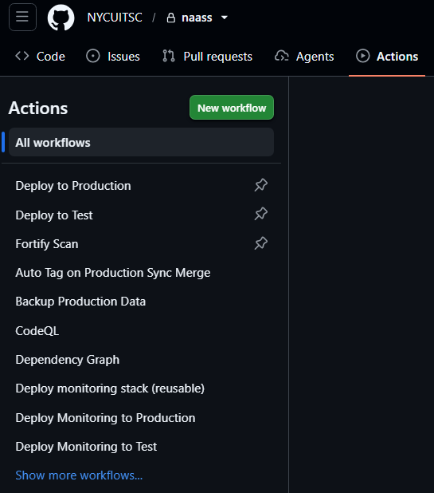
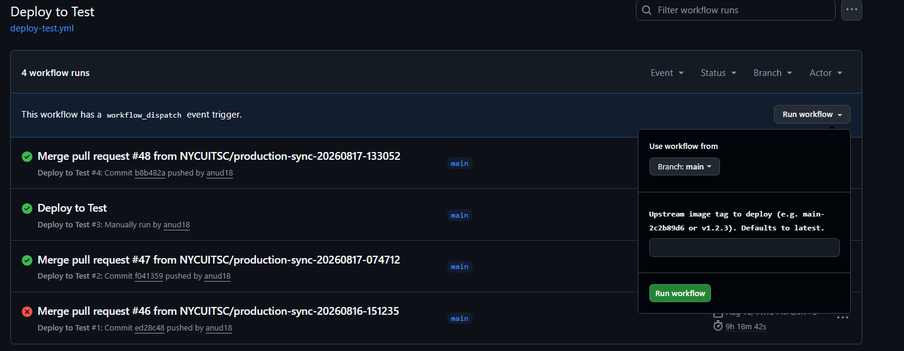
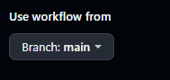
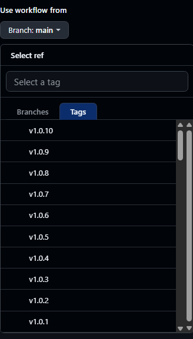
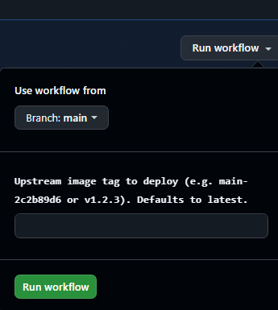

# Step 1
進到 GitHub Action 網站
https://github.com/NYCUITSC/naass/actions

# Step 2
選擇要還原或啟動 Test 還是 Production 環境
點擊對應的 workflow

`Deploy to Production`

`Deploy to Test`

# Step 3
點擊 Run Workflow

選取要還原到或者是啟動哪一個版本

以及在 `Upstream image tag to deploy (e.g. main-2c2b89d6 or v1.2.3). Defaults to latest.` 輸入版本名稱
像是 `v1.0.0`
接著點擊綠色的 `Run workflow`

